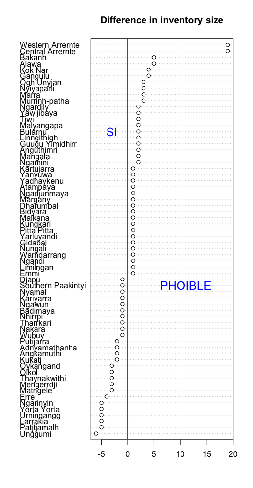
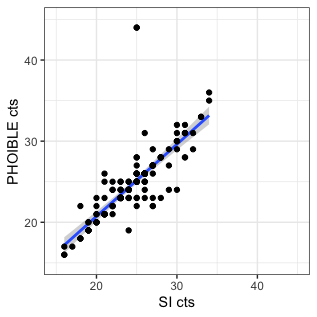
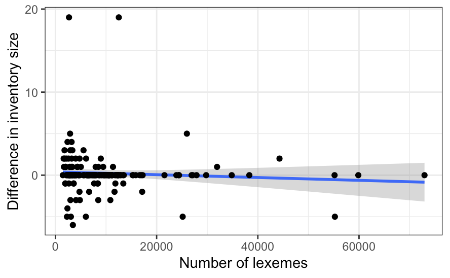
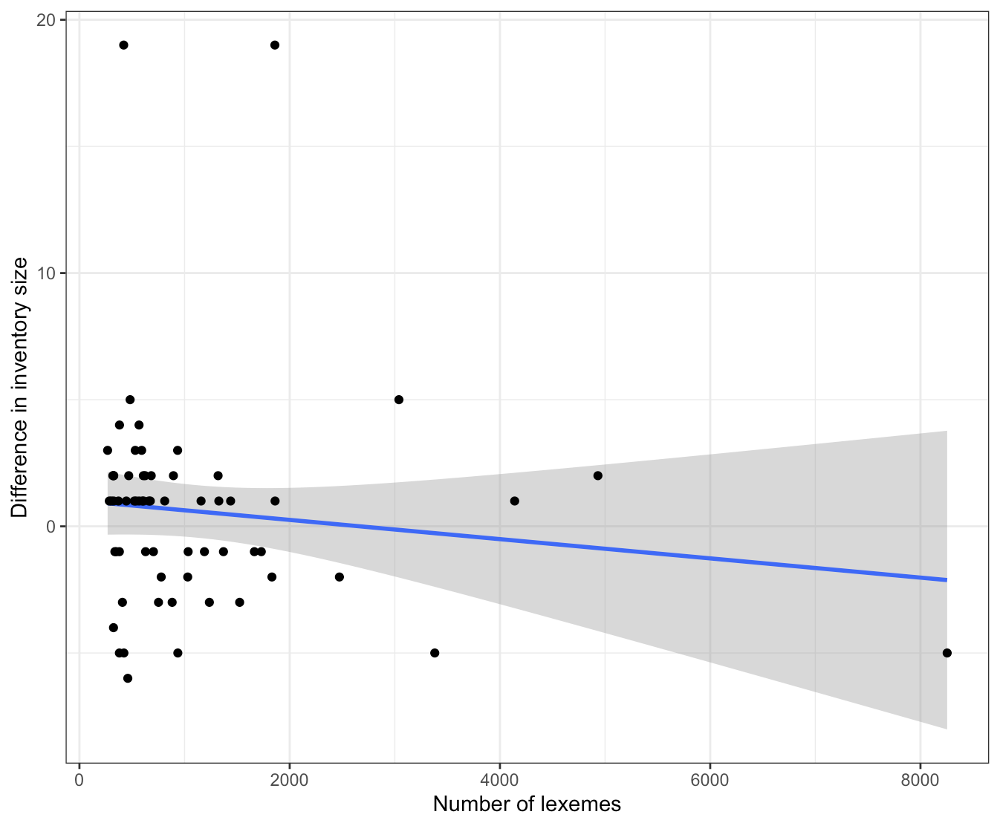

```{r, warning=FALSE, message=FALSE}
library(readr)
library(dplyr)
library(testthat)
library(knitr)
```

# Overview

This report is part of my open review of submitted to [Frontiers Psychology](https://www.frontiersin.org/journals/psychology).

* Manuscript title: Re-evaluating phoneme frequencies
* Manuscript ID: 570895
* Authors: Jayden Luke Macklin-Cordes, Erich Ross Round
* Journal: Frontiers in Psychology, section Language Sciences
* Article type: Original Research
* Submitted on: 09 Jun 2020

A preprint of the paper is available on arXiv.org:

* https://arxiv.org/abs/2006.05206

and the paper's supplementary materials are available on Zenodo:

* https://zenodo.org/record/3886212#.XyQzGxMzZGB

One claim made by the authors in their paper is that:

> "our dataset of phoneme frequencies is very likely to contain the complete population of phonemes in each language" 

in their language sample. However, the authors do not actually test this claim in their paper.

As part of my review, I wanted to know if this claim is true or not. Hence, I evaluate it below using their openly available supplementary data and corresponding phoneme inventories reported in the [PHOIBLE](https://phoible.org/) database, as generously provided in 2019 by the second author (Erich Round).


# Data prep

Load the supplementary data (SI) from the paper.

```{r}
df <- read_tsv('S4-S5_data_code_and_viewer/data/Aus_segment_frequencies_2020-05-21.tsv')
```

Get the language name and their phoneme counts.

```{r}
counts <- df %>% group_by(lex_ID, variety_name) %>% summarize(si_phonemes = n())
```

Confirm what the authors write in the paper, i.e. that the dataset has:

* 168 language varieties
* phoneme inventory sizes that range from 16-34

```{r}
expect_equal(nrow(counts), 168)
expect_equal(range(counts$si_phonemes), c(16, 34))
```

Compare the phoneme counts in the word lists to the phoneme counts of the languages as they are described in [PHOIBLE](https://phoible.org/).

Load the [PHOIBLE data](https://github.com/phoible/dev).

```{r, message=FALSE}
phoible <- read_csv(url('https://github.com/phoible/dev/blob/master/data/phoible.csv?raw=true'))
```

Get the ER (Erich Round) source for [Australian phonemic inventories contributed to PHOIBLE 2.0](https://zenodo.org/record/3464333#.XyUvnBMzY3E) in PHOIBLE.

```{r}
er <- phoible %>% filter(Source=="er") %>% select(InventoryID, Source, LanguageName, Phoneme) 
```

Let's have a look.

```{r}
er %>% head() %>% kable()
```

Get the phoneme inventory counts.

```{r}
er.counts <- er %>% group_by(InventoryID, Source, LanguageName) %>% summarize(phoible_phonemes = n())
```

So given that the data do not contain standardized language name identifiers such as [ISO 639-3](https://iso639-3.sil.org/) or [Glottolog codes](https://glottolog.org/glottolog/glottologinformation), let's see how many we can match on based on the language names from the paper and in PHOIBLE.

There are many more inventories in PHOIBLE than in the SI data (note the authors take only the languages that have more than 250 lexical items in their wordlists, so this isn't surprising).

```{r}
nrow(er.counts)
```

Which sources are in the SI and not in PHOIBLE (at least according to strict language name matching)?

```{r}
anti_join(counts, er.counts, by=c('variety_name'='LanguageName'))
```

Only three out of 165. Nice!

Let's get the delta between the ER phoneme inventories in PHOIBLE and what is reported in the SI.

```{r}
m <- inner_join(er.counts, counts, by=c('LanguageName'='variety_name'))
m$delta <- abs(m$phoible_phonemes - m$si_phonemes)
```

For the most languages, the difference is quite small, but there are two outliers.

```{r}
table(m$delta) %>% kable()
```

Which languages have a diference of 19 phoneme between sources?

```{r}
m %>% filter(delta==19)
```

These differences could be due to several factors. For example:

* the phoneme inventories in PHOIBLE are wrong (i.e. the editors made a mistake in loading the ER data)
* the SI data are incorrect somehow (the original wordlists are not provided, so it's not possible to evaluate whether or not the code that generates the phoneme frequency counts from wordlists is at fault)
* the lexical data from the authors, in these two cases, are encoded in an orthography/transcription that collapses phonemic contrasts?

And of course other stuff that I'm not considering (but see below).

Here are the inventories in PHOIBLE:

* https://phoible.org/inventories/view/2706
* https://phoible.org/inventories/view/2710

If we compare the inventories side-by-side, e.g. for Central Arrernte, we see the SI phonemes lack labialized consonants:

```{r}
phoible %>% filter(InventoryID == 2706) %>% pull(Phoneme)
```

```{r}
df %>% filter(lex_ID == 1006) %>% pull(match)
```

The labialized consonants are in the original data provided to PHOIBLE:

* https://github.com/bambooforest/phoible-scripts/tree/master/ER/data/formatted2019

Thus perhaps the difference has something to do with the phoneme parsing routine of the lexical data for the paper, e.g. digraphs like <tw> being split into <t> and <w>? The authors mention that they use [orthography profiles](https://langsci-press.org/catalog/book/176) to process the data. If these were made openly available, we could have a quick look. They also note in their SI (page 5) that for Central Arrernte: "Phonemic normalization: Labialized consonants normalized to C + w."

Delving into the possible differences a bit deeper, a quick look at the Wikipedia article [Arrernte language](https://en.wikipedia.org/wiki/Arrernte_language) has a consonant chart that also lists the labialized consonants:

https://en.wikipedia.org/wiki/Arrernte_language

But it is unclear whether the chart lists phones or phonemes. The only hint we get is:

> "It seems that the vowel system derives from an earlier one with more phonemes, but after the development of labialised consonants in the vicinity of round vowels, the vowels lost their roundedness/backness distinction, merging into just two phonemes."

Let's have a look at the original source description, i.e. the doculect from which the Central Arrernte phoneme inventory was extracted for the ER source in PHOIBLE:

* Breen, Gavan. 2001. The wonders of Arandic phonology. In Simpson, Jane and Nash, David and Laughren, Mary and Austin, Peter and Alpher, Barry (eds.), Forty Years on: Ken Hale and Australian languages, 45–70. Pacific Linguistics. Online: http://sealang.net/archives/pl/pdf/PL-512.45.pdf

Browsing quickly through the chapter, we find there is some controversy about the rounding of consonats (Breen, 2001, pg. 49):

> "Since this type of analysis, involving rounding of consonants, has been accepted, consonant inventories have often been described as including a certain number (for example, 26 for CAr) of unrounded consonants plus a rounded consonant corresponding to each unrounded member of the inventory. There are doubts about this, however; roundness seems not to be associated with consonants as such, but with consonant positions in a word-which might be occupied by one or two consonants."

This would also explain why a second phoneme inventory for Central Arrernte based on the JIPA article by Breen & Dobson 2005 lacks labialized consonants:

* https://phoible.org/inventories/view/2158

See:

* Breen, Gavan and Dobson, Veronica. 2005. Illustrations of the IPA: Central Arrernte. Journal of the International Phonetic Association 35. 249–254. Cambridge University Press. URL: https://www.jstor.org/stable/44526369

Labialized consonants are not listed in the consonant chart in this article and Breen & Dobson (2005, pg. 249) note:

> "All of these consonants except /w/ and /ɰ/ have rounded as well as unrounded forms, but these are now regarded as having rounding associated with a consonant position (C or CC) in a word rather than as a phonological feature of the particular consonant(s). Nevertheless rounded forms as well as unrounded are exemplified."


# Do the two sources correlate?

So, what about the correlation between phonological inventory counts between the two sources?

```{r}
cor.test(m$phoible_phonemes, m$si_phonemes)
```

And if we remove the outliers?

```{r}
m_less <- m %>% filter(delta!=19)
cor.test(m_less$phoible_phonemes, m_less$si_phonemes)
```

Even without removing the outliers, the correlation looks pretty good. 

Since both the paper preprint and data from the supplementary materials are openly available from the authors online, I mentioned the issue of correlation to my colleague [Nicholas Lester](http://nicholaslester.weebly.com/).

Nick generated a few plots and made comments that I think might be useful to the authors as well.

First, he generated a plot with GAM smooth:



Nick notes:

> "So you see, the most variability comes in the middle ranges, and perhaps SI is slightly more guilty of overestimation (points below the line), but not by much. And as your table shows, the differences tend to be rather small (outside of the two outliers you mention). But it would be interesting to see what factors influence these variations (you have already identified the labialized consonants thing, but perhaps other factors play a role)." 

Second, he generated a Cleveland's dot plot to show which languages show the biggest differences (negative = SI bigger; positive = PHOIBLE bigger).



Nick also asked whether the size of the documented lexicon or the number of attested segments overall impacts the difference in inventory size. It does not appear to be so.

However, he notes:

> "What it DOES predict is the amount of variance in the sample. Lower numbers of segments or lexemes in the SI data show much greater variability in the difference between PHOIBLE and SI. This means that smaller samples are less reliable (as we should expect). As expected given the other paper you sent, convergence appears to gain strength starting around 500 items."

As shown in this plot:



This trend also holds if we remove the matching (0 difference) languages:



And he notes:

> "One thing I *think* I see is that the variance for "SI = higher count" languages (below the regression line) tends to shrink at a slower rate than that for "PHOIBLE = higher count" languages." There are clearly many possible reasons for this, but it says something like: "increasing the number of types in the sample for this study tends to produce larger inventory size estimates for SI than have been observed elsewhere in PHOIBLE, and the two databases are at greatest odds with one another when the SI sample lexicon was smaller."

One could dig through the other discrepencies in the table above and identify where the controversies, or mistakes, are. We leave this up to the authors.

Lastly, another question to ask, is whether consonants or vowels more or less likely to lead to discripencies between the counts?

