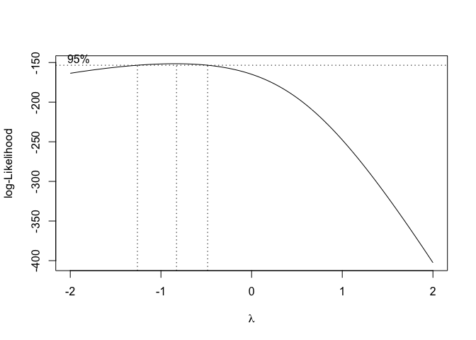

Correlation analysis accompaniment for review of Macklin-Cordes & Round
2020
================
Steven Moran & Nicholas Lester
(03 August, 2020)

    library(readr)
    library(dplyr)
    library(testthat)
    library(knitr)
    library(ggplot2)
    library(MASS)
    library(gam)

Overview
========

This report is an accompaniment of a [review of Macklin-Cordes &
Round](https://github.com/bambooforest/reviews/blob/master/Macklin-CordesRound2020/review.md),
solicited by editors of [Frontiers
Psychology](https://www.frontiersin.org/journals/psychology) to Steven
Moran
&lt;<a href="mailto:steven.moran@uzh.ch" class="email">steven.moran@uzh.ch</a>&gt;.
Details about the submission:

-   Manuscript title: Re-evaluating phoneme frequencies
-   Manuscript ID: 570895
-   Authors: Jayden Luke Macklin-Cordes, Erich Ross Round
-   Journal: Frontiers in Psychology, section Language Sciences
-   Article type: Original Research
-   Submitted on: 09 Jun 2020

A preprint of the paper was made available by the authors on arXiv.org:

-   <a href="https://arxiv.org/abs/2006.05206" class="uri">https://arxiv.org/abs/2006.05206</a>

and the paper’s supplementary materials are available on Zenodo:

-   <a href="https://zenodo.org/record/3886212#.XyQzGxMzZGB" class="uri">https://zenodo.org/record/3886212#.XyQzGxMzZGB</a>

The aim of this report is to investigate a claim made by the authors:

> “our dataset of phoneme frequencies is very likely to contain the
> complete population of phonemes in each language”

However, the authors do not actually test this claim in their paper.

As part of my review (SM), I wanted to know if this claim is true or
not. Hence, I evaluate it below using the openly available supplementary
data and corresponding phoneme inventories reported in the
[PHOIBLE](https://phoible.org/) database, as generously provided in 2019
by the second author ([Erich
Round](https://researchers.uq.edu.au/researcher/1761)).

Discussions with [Nicholas Lester](http://nicholaslester.weebly.com/)
led to some additional descriptive studies and plots, below.

Data prep
=========

Load the supplementary data (SI) from the paper.

    df <- read_tsv('S4-S5_data_code_and_viewer/data/Aus_segment_frequencies_2020-05-21.tsv')

    ## Parsed with column specification:
    ## cols(
    ##   lex_ID = col_double(),
    ##   match = col_character(),
    ##   count = col_double(),
    ##   freq = col_double(),
    ##   variety_name = col_character(),
    ##   n_forms = col_double(),
    ##   n_phon_segs = col_double()
    ## )

Get the language name and their phoneme counts.

    counts <- df %>% group_by(lex_ID, variety_name) %>% summarize(si_phonemes = n())

    ## `summarise()` regrouping output by 'lex_ID' (override with `.groups` argument)

Confirm what the authors write in the paper, i.e. that the dataset has:

-   168 language varieties
-   phoneme inventory sizes that range from 16-34

<!-- -->

    expect_equal(nrow(counts), 168)
    expect_equal(range(counts$si_phonemes), c(16, 34))

Compare the phoneme counts in the word lists to the phoneme counts of
the languages as they are described in [PHOIBLE](https://phoible.org/).

Load the [PHOIBLE data](https://github.com/phoible/dev).

    phoible <- read_csv(url('https://github.com/phoible/dev/blob/master/data/phoible.csv?raw=true'))

    ## Warning: 21986 parsing failures.
    ##   row             col           expected       actual         file
    ## 21603 SpecificDialect 1/0/T/F/TRUE/FALSE Adja (Bénin) <connection>
    ## 21604 SpecificDialect 1/0/T/F/TRUE/FALSE Adja (Bénin) <connection>
    ## 21605 SpecificDialect 1/0/T/F/TRUE/FALSE Adja (Bénin) <connection>
    ## 21606 SpecificDialect 1/0/T/F/TRUE/FALSE Adja (Bénin) <connection>
    ## 21607 SpecificDialect 1/0/T/F/TRUE/FALSE Adja (Bénin) <connection>
    ## ..... ............... .................. ............. ............
    ## See problems(...) for more details.

Get the ER (Erich Round) source for [Australian phonemic inventories
contributed to PHOIBLE
2.0](https://zenodo.org/record/3464333#.XyUvnBMzY3E) in PHOIBLE.

    er <- phoible %>% filter(Source == "er") %>% dplyr::select(InventoryID, Source, LanguageName, Phoneme) 

Let’s have a look.

    er %>% head() %>% kable()

| InventoryID | Source | LanguageName | Phoneme |
|------------:|:-------|:-------------|:--------|
|        2629 | er     | Burarra      | j       |
|        2629 | er     | Burarra      | k͈       |
|        2629 | er     | Burarra      | k͉       |
|        2629 | er     | Burarra      | l       |
|        2629 | er     | Burarra      | m       |
|        2629 | er     | Burarra      | n       |

Get the phoneme inventory counts.

    er.counts <- er %>% group_by(InventoryID, Source, LanguageName) %>% summarize(phoible_phonemes = n())

    ## `summarise()` regrouping output by 'InventoryID', 'Source' (override with `.groups` argument)

So given that the data do not contain standardized language name
identifiers such as [ISO 639-3](https://iso639-3.sil.org/) or [Glottolog
codes](https://glottolog.org/glottolog/glottologinformation), let’s see
how many we can match on based on the language names from the paper and
in PHOIBLE.

There are many more inventories in PHOIBLE than in the SI data (note the
authors take only the languages that have more than 250 lexical items in
their wordlists, so this isn’t surprising).

    nrow(er.counts)

    ## [1] 392

Which sources are in the SI and not in PHOIBLE (at least according to
strict language name matching)?

    anti_join(counts, er.counts, by = c('variety_name' = 'LanguageName'))

    ## # A tibble: 3 x 3
    ## # Groups:   lex_ID [3]
    ##   lex_ID variety_name si_phonemes
    ##    <dbl> <chr>              <int>
    ## 1    288 Wangkatja             23
    ## 2    618 Mirniny               25
    ## 3    968 Ogh Angkula           24

Only three out of 165. Nice!

Let’s get the delta between the ER phoneme inventories in PHOIBLE and
what is reported in the SI.

    m <- inner_join(er.counts, counts, by = c('LanguageName' = 'variety_name'))
    m$delta <- abs(m$phoible_phonemes - m$si_phonemes)

For the most languages, the difference is quite small, but there are two
outliers.

    table(m$delta) %>% kable()

| Var1 | Freq |
|:-----|-----:|
| 0    |  101 |
| 1    |   28 |
| 2    |   14 |
| 3    |    9 |
| 4    |    3 |
| 5    |    7 |
| 6    |    1 |
| 19   |    2 |

Which languages have a difference of 19 phoneme between sources?

    m %>% filter(delta==19)

    ## # A tibble: 2 x 7
    ## # Groups:   InventoryID, Source [2]
    ##   InventoryID Source LanguageName     phoible_phonemes lex_ID si_phonemes delta
    ##         <dbl> <chr>  <chr>                       <int>  <dbl>       <int> <int>
    ## 1        2706 er     Central Arrernte               44   1006          25    19
    ## 2        2710 er     Western Arrernte               44    200          25    19

These differences could be due to several factors. For example:

-   the phoneme inventories in PHOIBLE are wrong (i.e. the editors made
    a mistake in loading the ER data)
-   the SI data are incorrect somehow (the original wordlists are not
    provided, so it’s not possible to evaluate whether or not the code
    that generates the phoneme frequency counts from wordlists is at
    fault)
-   the lexical data from the authors, in these two cases, are encoded
    in an orthography/transcription that collapses phonemic contrasts?

And of course other stuff that I’m not considering (but see below).

Here are the inventories in PHOIBLE:

-   <a href="https://phoible.org/inventories/view/2706" class="uri">https://phoible.org/inventories/view/2706</a>
-   <a href="https://phoible.org/inventories/view/2710" class="uri">https://phoible.org/inventories/view/2710</a>

If we compare the inventories side-by-side, e.g. for Central Arrernte,
we see the SI phonemes lack labialized consonants:

    phoible %>% filter(InventoryID == 2706) %>% pull(Phoneme)

    ##  [1] "j"       "jʷ"      "k"       "kʷ"      "l"       "lʷ"      "l̪"      
    ##  [8] "l̪ʷ"      "m"       "mʷ"      "n"       "nʷ"      "n̪"       "n̪ʷ"     
    ## [15] "p"       "pʷ"      "r"       "rʷ"      "t"       "tʷ"      "t̪"      
    ## [22] "t̪ʷ"      "w"       "ŋ"       "ŋʷ"      "\u0234"  "\u0234ʷ" "\u0235" 
    ## [29] "\u0235ʷ" "\u0236"  "\u0236ʷ" "ɭ"       "ɭʷ"      "ɰ"       "ɳ"      
    ## [36] "ɳʷ"      "ɻ"       "ɻʷ"      "ʈ"       "ʈʷ"      "a"       "i"      
    ## [43] "u"       "ə"

    df %>% filter(lex_ID == 1006) %>% pull(match)

    ##  [1] "a"      "ə"      "i"      "j"      "k"      "l"      "l̪"      "ɭ"     
    ##  [9] "\u0234" "m"      "n"      "n̪"      "ɳ"      "\u0235" "ŋ"      "p"     
    ## [17] "r"      "ɻ"      "t"      "t̪"      "ʈ"      "\u0236" "u"      "ɰ"     
    ## [25] "w"

The labialized consonants are in the original data provided to PHOIBLE:

-   <a href="https://github.com/bambooforest/phoible-scripts/tree/master/ER/data/formatted2019" class="uri">https://github.com/bambooforest/phoible-scripts/tree/master/ER/data/formatted2019</a>

Thus perhaps the difference has something to do with the phoneme parsing
routine of the lexical data for the paper, e.g. digraphs like <tw> being
split into <t> and <w>? The authors mention that they use [orthography
profiles](https://langsci-press.org/catalog/book/176) to process the
data. If these were made openly available, we could have a quick look.
They also note in their SI (page 5) that for Central Arrernte: “Phonemic
normalization: Labialized consonants normalized to C + w.”

Delving into the possible differences a bit deeper, a quick look at the
Wikipedia article [Arrernte
language](https://en.wikipedia.org/wiki/Arrernte_language) has a
consonant chart that also lists the labialized consonants:

<a href="https://en.wikipedia.org/wiki/Arrernte_language" class="uri">https://en.wikipedia.org/wiki/Arrernte_language</a>

But it is unclear whether the chart lists phones or phonemes. The only
hint we get is:

> “It seems that the vowel system derives from an earlier one with more
> phonemes, but after the development of labialised consonants in the
> vicinity of round vowels, the vowels lost their roundedness/backness
> distinction, merging into just two phonemes.”

Let’s have a look at the original source description, i.e. the doculect
from which the Central Arrernte phoneme inventory was extracted for the
ER source in PHOIBLE:

-   Breen, Gavan. 2001. The wonders of Arandic phonology. In Simpson,
    Jane and Nash, David and Laughren, Mary and Austin, Peter and
    Alpher, Barry (eds.), Forty Years on: Ken Hale and Australian
    languages, 45–70. Pacific Linguistics. Online:
    <a href="http://sealang.net/archives/pl/pdf/PL-512.45.pdf" class="uri">http://sealang.net/archives/pl/pdf/PL-512.45.pdf</a>

Browsing quickly through the chapter, we find there is some controversy
about the rounding of consonants (Breen, 2001, pg. 49):

> “Since this type of analysis, involving rounding of consonants, has
> been accepted, consonant inventories have often been described as
> including a certain number (for example, 26 for CAr) of unrounded
> consonants plus a rounded consonant corresponding to each unrounded
> member of the inventory. There are doubts about this, however;
> roundness seems not to be associated with consonants as such, but with
> consonant positions in a word-which might be occupied by one or two
> consonants.”

This would also explain why a second phoneme inventory for Central
Arrernte based on the JIPA article by Breen & Dobson 2005 lacks
labialized consonants:

-   <a href="https://phoible.org/inventories/view/2158" class="uri">https://phoible.org/inventories/view/2158</a>

See:

-   Breen, Gavan and Dobson, Veronica. 2005. Illustrations of the IPA:
    Central Arrernte. Journal of the International Phonetic
    Association 35. 249–254. Cambridge University Press. URL:
    <a href="https://www.jstor.org/stable/44526369" class="uri">https://www.jstor.org/stable/44526369</a>

Labialized consonants are not listed in the consonant chart in this
article and Breen & Dobson (2005, pg. 249) note:

> “All of these consonants except /w/ and /ɰ/ have rounded as well as
> unrounded forms, but these are now regarded as having rounding
> associated with a consonant position (C or CC) in a word rather than
> as a phonological feature of the particular consonant(s). Nevertheless
> rounded forms as well as unrounded are exemplified.”

One could dig through the other discrepancies in the table above and
identify where the differences are. We leave this up to the authors.

Do the two sources correlate?
=============================

So, what about the correlation between phonological inventory counts
between the two sources?

    cor.test(m$phoible_phonemes, m$si_phonemes)

    ## 
    ##  Pearson's product-moment correlation
    ## 
    ## data:  m$phoible_phonemes and m$si_phonemes
    ## t = 16.355, df = 163, p-value < 2.2e-16
    ## alternative hypothesis: true correlation is not equal to 0
    ## 95 percent confidence interval:
    ##  0.7224954 0.8398972
    ## sample estimates:
    ##       cor 
    ## 0.7882659

And if we remove the outliers?

    m_less <- m %>% filter(delta!=19)
    cor.test(m_less$phoible_phonemes, m_less$si_phonemes)

    ## 
    ##  Pearson's product-moment correlation
    ## 
    ## data:  m_less$phoible_phonemes and m_less$si_phonemes
    ## t = 27.113, df = 161, p-value < 2.2e-16
    ## alternative hypothesis: true correlation is not equal to 0
    ## 95 percent confidence interval:
    ##  0.8736400 0.9299675
    ## sample estimates:
    ##       cor 
    ## 0.9057249

Even without removing the outliers, the correlation looks pretty good.

Since both the paper preprint and data from the supplementary materials
are openly available from the authors online, I mentioned the issue of
correlation to my colleague [Nicholas
Lester](http://nicholaslester.weebly.com/).

Nick generated a few plots and made comments that may be useful to the
authors.

First, plot the correlation between the counts from the SI and PHOIBLE
estimates.

    # Plotting correlation with GAM smooth and observed points
    library(ggplot2)
    p = ggplot(m, aes(x = si_phonemes, y = phoible_phonemes)) + 
        geom_smooth(method="gam", formula = y ~ s(x, bs="tp")) +
        geom_point() +
        xlab("SI cts") + 
        ylab("PHOIBLE cts") +
        ylim(15, 45) +
        xlim(15, 45) +
        theme_bw()

    p

<!-- -->

    # Create a new measure delta_true (so we get a sign
    # to indicate which dataset predicts larger/smaller
    # inventory)
    m$delta_true = m$phoible_phonemes-m$si_phonemes

    # Pare down the data to just the languages that disagree
    # between the two datasets in their estimates of
    # inventory size (m.dc)
    m.dc = m[m$delta>0,]

    # Order the dataframe for prettier plotting
    m.dc = m.dc[order(m.dc$delta_true),]

    # Dotchart showing the differences between the inventory
    # size estimates (positive = PHOIBLE is larger; negative
    # = SI is larger)
    dotchart(x = m.dc$delta_true, labels = m.dc$LanguageName, main="Difference in inventory size")
    abline(v=0, col="red", lwd=2)
    text(-3, 50, "SI", cex = 1.5, col = "blue")
    text(11, 25, "PHOIBLE", cex = 1.5, col = "blue")

<!-- -->

Nick notes:

> “So you see, the most variability comes in the middle ranges, and
> perhaps SI is slightly more guilty of overestimation (points below the
> line), but not by much. And as your table shows, the differences tend
> to be rather small (outside of the two outliers you mention). But it
> would be interesting to see what factors influence these variations
> (you have already identified the labialized consonants thing, but
> perhaps other factors play a role).”

Another question concerns how the number of word forms or segments
represented in the corpus influence the degree of similarity between the
inventory size estimates for SI and PHOIBLE.

    # Merge the SI form and segment counts with the m table of counts
    df$LanguageName = df$variety_name
    m.wcounts = left_join(m, unique(df[, c("LanguageName", "n_forms", "n_phon_segs")]), by = "LanguageName")

    m.wcounts = as.data.frame(m.wcounts)

    # Difference in size estimates as a function of word forms
    p2 = ggplot(m.wcounts, aes(x = n_forms, y = delta_true)) + 
         geom_smooth(method="gam", formula = y ~ s(x, bs="tp")) +
         geom_point() +
         xlab("Number of lexemes") + 
         ylab("Difference in inventory size") +
         theme_bw()

    p2

<!-- -->

    ## Now use the cut-off of 450, as suggested by Bowern
    p2a = ggplot(m.wcounts[m.wcounts$n_forms>=450,], aes(x = n_forms, y = delta_true)) + 
         geom_smooth(method="gam", formula = y ~ s(x, bs="tp")) +
         geom_point() +
         xlab("Number of lexemes") + 
         ylab("Difference in inventory size") +
         theme_bw()

    p2a

<!-- -->

    # Difference in size estimates as a function of segment count
    p3 = ggplot(m.wcounts, aes(x = n_phon_segs, y = delta_true)) + 
         geom_smooth(method="gam", formula = y ~ s(x, bs="tp")) +
         geom_point() +
         xlab("Number of lexemes") + 
         ylab("Difference in inventory size") +
         theme_bw()

    p3

<!-- -->

    # Take out the languages that do not differ from each other
    m.wcounts.diff = m.wcounts[m.wcounts$delta_true!=0,]

    # Difference in size estimates as a function of word forms
    p4 = ggplot(m.wcounts.diff, aes(x = n_forms, y = delta_true)) + 
         geom_smooth(method="gam", formula = y ~ s(x, bs="tp")) +
         geom_point() +
         xlab("Number of lexemes") + 
         ylab("Difference in inventory size") +
         theme_bw()

    p4

<!-- -->

    # Difference in size estimates as a function of segment count
    p5 = ggplot(m.wcounts.diff, aes(x = n_phon_segs, y = delta_true)) + 
         geom_smooth(method="gam", formula = y ~ s(x, bs="tp")) +
         geom_point() +
         xlab("Number of lexemes") + 
         ylab("Difference in inventory size") +
         theme_bw()

    p5

<!-- -->

The Cleveland’s dot plots show which languages show the biggest
differences (negative = SI bigger; positive = PHOIBLE bigger).

Nick also asked whether the size of the documented lexicon or the number
of attested segments overall impacts the difference in inventory size.
It does not appear to be so.

However, he notes:

> “What it DOES predict is the amount of variance in the sample. Lower
> numbers of segments or lexemes in the SI data show much greater
> variability in the difference between PHOIBLE and SI. This means that
> smaller samples are less reliable (as we should expect). As expected
> given the other paper you sent, convergence appears to gain strength
> starting around 500 items.”

This trend also holds if we remove the matching (0 difference)
languages, as shown above.

Nick notes:

> “One thing I *think* I see is that the variance for”SI = higher count"
> languages (below the regression line) tends to shrink at a slower rate
> than that for “PHOIBLE = higher count” languages." There are clearly
> many possible reasons for this, but it says something like:
> “increasing the number of types in the sample for this study tends to
> produce larger inventory size estimates for SI than have been observed
> elsewhere in PHOIBLE, and the two databases are at greatest odds with
> one another when the SI sample lexicon was smaller.”

Lastly, another question to ask, is whether consonants or vowels more or
less likely to lead to discrepancies between the counts?

    # Get additional information on segments
    m.cv = left_join(unique(df[, c("LanguageName", "match", "n_forms", "n_phon_segs", "lex_ID")]), unique(phoible[,c("Phoneme", "SegmentClass")]), by = c("match" = "Phoneme"))

    # Remove consonants and vowels into separate dataframes
    ## Consonants
    m.c = m.cv %>% filter(SegmentClass == "consonant")

    ## Vowels
    m.v = m.cv %>% filter(SegmentClass == "vowel")

    # Recompute counts separately
    ## Consonants
    counts.c = m.c %>% group_by(lex_ID, LanguageName) %>% summarize(si_phonemes_c = n())

    ## `summarise()` regrouping output by 'lex_ID' (override with `.groups` argument)

    ## Vowels
    counts.v = m.v %>% group_by(lex_ID, LanguageName) %>% summarize(si_phonemes_v = n())

    ## `summarise()` regrouping output by 'lex_ID' (override with `.groups` argument)

    # Now, do the same for PHOIBLE
    p.er = phoible %>% filter(Source=="er") %>% dplyr::select(InventoryID, Source, LanguageName, Phoneme, SegmentClass)

    ## Consonants only
    p.c = p.er %>% filter(SegmentClass == "consonant")

    ## Vowels only
    p.v = p.er %>% filter(SegmentClass =="vowel")

    # Get the counts
    ## Consonants
    er.counts.c <- p.c %>% group_by(InventoryID, Source, LanguageName) %>% summarize(phoible_phonemes_c = n())

    ## `summarise()` regrouping output by 'InventoryID', 'Source' (override with `.groups` argument)

    ## Vowels
    er.counts.v = p.v %>% group_by(InventoryID, Source, LanguageName) %>% summarize(phoible_phonemes_v = n())

    ## `summarise()` regrouping output by 'InventoryID', 'Source' (override with `.groups` argument)

    # Find the common languages between the data from SI and PHOIBLE
    ## Consonants
    anti_join(counts.c, er.counts.c, by='LanguageName')

    ## # A tibble: 3 x 3
    ## # Groups:   lex_ID [3]
    ##   lex_ID LanguageName si_phonemes_c
    ##    <dbl> <chr>                <int>
    ## 1    288 Wangkatja               17
    ## 2    618 Mirniny                 20
    ## 3    968 Ogh Angkula             18

    ## Vowels
    anti_join(counts.v, er.counts.v, by='LanguageName')

    ## # A tibble: 3 x 3
    ## # Groups:   lex_ID [3]
    ##   lex_ID LanguageName si_phonemes_v
    ##    <dbl> <chr>                <int>
    ## 1    288 Wangkatja                6
    ## 2    618 Mirniny                  5
    ## 3    968 Ogh Angkula              6

    # Combine the data from SI and PHOIBLE
    ## Consonants
    consonants = inner_join(er.counts.c, counts.c, by='LanguageName')

    ### Add difference measures
    consonants$true_delta = consonants$phoible_phonemes_c - consonants$si_phonemes_c

    consonants$delta <- abs(consonants$true_delta)

    ## Vowels
    vowels = inner_join(er.counts.v, counts.v, by='LanguageName')

    ### Add difference measures
    vowels$true_delta = vowels$phoible_phonemes_v - vowels$si_phonemes_v

    vowels$delta <- abs(vowels$true_delta)

    # Test correlations between counts
    cor.test(consonants$si_phonemes_c, consonants$phoible_phonemes_c)

    ## 
    ##  Pearson's product-moment correlation
    ## 
    ## data:  consonants$si_phonemes_c and consonants$phoible_phonemes_c
    ## t = 17.151, df = 163, p-value < 2.2e-16
    ## alternative hypothesis: true correlation is not equal to 0
    ## 95 percent confidence interval:
    ##  0.7400690 0.8506806
    ## sample estimates:
    ##       cor 
    ## 0.8021528

    cor.test(vowels$si_phonemes_v, vowels$phoible_phonemes_v)

    ## 
    ##  Pearson's product-moment correlation
    ## 
    ## data:  vowels$si_phonemes_v and vowels$phoible_phonemes_v
    ## t = 25.521, df = 163, p-value < 2.2e-16
    ## alternative hypothesis: true correlation is not equal to 0
    ## 95 percent confidence interval:
    ##  0.8589083 0.9212378
    ## sample estimates:
    ##       cor 
    ## 0.8943314

Consonants are slightly worse than vowels.

    # Now create a long-form dataframe
    c.long = consonants
    colnames(c.long)[c(4, 6)] = c("phoible_phonemes", "si_phonemes")
    c.long$segment_class = rep("consonant", nrow(c.long))

    v.long = vowels
    colnames(v.long)[c(4, 6)] = c("phoible_phonemes", "si_phonemes")
    v.long$segment_class = rep("vowel", nrow(v.long))

    long.dat = bind_rows(c.long, v.long)

    long.mod.dat = long.dat[long.dat$delta>0,]

    boxcox(lm(delta~1, data=long.mod.dat))

<!-- -->

    long.mod.dat$tDelta = -1/long.mod.dat$delta

    # ...and predict the deltas as function of segment class
    model.cv = gam(tDelta ~ segment_class, data=long.mod.dat)

    model.cv = gam(true_delta ~ segment_class, data=long.mod.dat)
